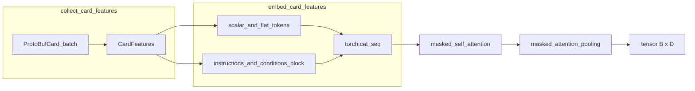

# Card embedding: data flow and parameters

This note matches the C++ implementation in [`CardEmbedding.cpp`](../src/CardEmbedding.cpp) and [`CardEmbedding.h`](../include/CardEmbedding.h). `ProtoBufCard` fields that are **not** read by `collect_card_features` (for example `name`, `evolves_from`, `pokemon_effects`, `attached_to`, `deck_id`, `attached_energy_cards`, `pre_evolution_ids`, `evolved_into`) are outside this module.

## Input and output

- **Input:** `std::vector<ProtoBufCard>` (batch of serialized card messages).
- **Output:** `torch::Tensor` of shape `[batch_size, D]` with `D = dimension_out` (constructor argument; benchmarks and goldens use `D = 32`).

Forward pass ([`CardEmbeddingImpl::forward`](../src/CardEmbedding.cpp)):

1. `collect_card_features` builds `CardFeatures` and nested `InstructionsAndConditions`.
2. `embed_card_features` returns token tensor `[B, T, D]` and boolean mask `[B, T]`.
3. `masked_self_attention(card_self_multi_head_attention_, tokens, mask)` applies residual self-attention: `tokens + MHA(tokens, tokens, tokens, padding_mask)` (see [`AttentionUtils::masked_self_attention`](../src/AttentionUtils.cpp)).
4. A learned query from `card_pooling_query_embedding_` (vocabulary size 1) attends over the sequence; [`masked_attention_pooling`](../src/AttentionUtils.cpp) produces one vector per batch row. Empty rows (no valid tokens) yield zeros.

## Proto fields consumed

Per card, scalars and masks:

| Field | Embedding | Mask |
|--------|-----------|------|
| `card_type` | `SharedEmbeddingHolder::card_type_embedding_` | always valid |
| `card_subtype` | `card_subtype_embedding_` | always valid |
| `energy_type` (optional) | `energy_type_embedding_` | `has_energy_type()` |
| `max_hp` (optional) | `hp_embedding_` (NormalizedLinear) | `has_max_hp()` |
| `weakness` (optional) | `energy_type_embedding_` | `has_weakness()` |
| `resistance` (optional) | `energy_type_embedding_` | `has_resistance()` |
| `retreat_cost` (optional) | `retreat_cost_embedding_` (NormalizedLinear) | `has_retreat_cost()` |
| `number_of_prize_cards_on_knockout` (optional) | `number_of_prize_cards_on_knockout_embedding_` | `has_number_of_prize_cards_on_knockout()` |
| `current_damage` (optional) | `current_damage_embedding_` | `has_current_damage()` |

Repeated fields (embedded then scattered into per-card slots; see below):

- `pokemon_turn_traits` → `pokemon_turn_trait_embedding_`
- `provided_energy` → `energy_type_embedding_`
- `attached_energy` → `energy_type_embedding_`

Structured:

- Top-level `instructions` / `conditions`
- `ability.instructions` / `ability.conditions`
- Each `attacks[i].energy_cost` and `attacks[i].instructions`

## Token sequence layout (`embed_card_features`)

Along sequence dimension `dim=1`, tensors are concatenated in this order ([`torch::cat` in `embed_card_features`](../src/CardEmbedding.cpp)):

1. One slot each: card type, subtype, energy type, max HP, weakness, resistance, retreat cost, prize count on knockout, current damage.
2. Turn traits: variable length per card (`embed_flattened_card_feature`).
3. Provided energies: variable length per card.
4. Attached energies: variable length per card.
5. Instruction/condition block from `embed_instructions_and_conditions` (see next section).

**Optional scalars:** the embedding is multiplied element-wise by the mask (0 or 1) so unset fields contribute zeros.

**Repeated fields:** indices are embedded, then written into a padded tensor `[B, L_max, D]` with mask `[B, L_max]`, where `L_max` is the maximum count of that feature over the batch (`embed_flattened_card_feature`).

## Instruction and condition subtree

`embed_instructions_and_conditions`:

1. Runs `InstructionEmbedding` on all instruction lists and `ConditionEmbedding` on all condition lists (flattened batch across cards, ability, and attacks).
2. Builds four groups, concatenated along the sequence dimension in this order:
   - **Card-level instructions:** query-pooled with `card_instructions_multi_head_attention_` and `card_instruction_query_embedding_`. If a card has no global instructions, a single zero slot with mask false is still allocated ([`embed_card_instructions`](../src/CardEmbedding.cpp)).
   - **Card-level conditions:** same pattern with `card_conditions_multi_head_attention_` / `card_condition_query_embedding_`.
   - **Ability:** for each ability with instructions, [`AbilityEmbedding`](../src/AbilityEmbedding.cpp) pools ability instructions and ability conditions with separate MHA+queries and **adds** the two pooled vectors. Rows align via `ability_condition_row_for_instruction_ability`. Padded to batch.
   - **Attacks:** for each attack with instructions, energy cost embeddings are **summed** per attack (`index_add_` over `energy_type_embedding_`), then concatenated with that attack’s instruction embeddings as `[energy_sum | instruction_tokens]` and pooled with [`AttackEmbedding`](../src/AttackEmbedding.cpp). Scattered to `(card_index, attack_index)`.

Instruction and condition **content** (per instruction data payload) is handled inside `InstructionDataEmbedding` and `ConditionEmbedding`, which share [`SharedEmbeddingHolder`](../src/SharedEmbeddingHolder.cpp) tables (`energy_type_embedding_`, `hp_embedding_`, `card_position_embedding_`, `damage_embedding_`, `card_amount_range_embedding_`, `player_target_embedding_`, `position_embedding_`, etc.). Exact layouts for those modules live in [`InstructionEmbedding.cpp`](../src/InstructionEmbedding.cpp), [`ConditionEmbedding.cpp`](../src/ConditionEmbedding.cpp), and [`InstructionDataEmbedding.cpp`](../src/InstructionDataEmbedding.cpp).

## NormalizedLinear

[`NormalizedLinear`](../src/NormalizedLinear.cpp): `y = W (x / s)` with **no bias**, where `s` is the constructor `divisor`.

## Submodule sizes (fixed or derived from D)

Let `D = dimension_out`. Define `d_head = max(D / 16, 4)` (integer division in C++).

### SharedEmbeddingHolder (also used by instruction/condition data)

| Submodule | Type | Shape / divisor |
|-----------|------|------------------|
| `card_type_embedding_` | Embedding | num_embeddings **4**, embedding_dim **D** |
| `card_subtype_embedding_` | Embedding | num_embeddings **10**, **D** |
| `hp_embedding_` | NormalizedLinear | in_features **1**, out **D**, divisor **400.0** |
| `card_amount_range_embedding_` | NormalizedLinear | in **2**, out **D**, divisor **400.0** |
| `card_position_embedding_` | Embedding | num_embeddings **11**, **D** |
| `player_target_embedding_` | Embedding | num_embeddings **2**, **D** |
| `position_embedding_` | PositionalEmbedding | max_len **5000**, amplitude **0.1**, dim **D** |
| `damage_embedding_` | NormalizedLinear | in **1**, out **D**, divisor **400.0** |
| `energy_type_embedding_` | Embedding | num_embeddings **11**, **D** |

### CardEmbedding-only modules

| Submodule | Type | Notes |
|-----------|------|--------|
| `retreat_cost_embedding_` | NormalizedLinear(1, D, divisor **10.0**) | |
| `number_of_prize_cards_on_knockout_embedding_` | NormalizedLinear(1, D, divisor **6.0**) | |
| `current_damage_embedding_` | NormalizedLinear(1, D, divisor **400.0**) | |
| `pokemon_turn_trait_embedding_` | Embedding(**2**, **D**) | enum `ProtoBufPokemonTurnTrait` |
| `card_instruction_query_embedding_` | Embedding(1, **D**) | |
| `card_condition_query_embedding_` | Embedding(1, **D**) | |
| `card_pooling_query_embedding_` | Embedding(1, **D**) | |
| `card_instructions_multi_head_attention_` | MultiHeadAttention | d_q=d_k=d_v=**D**, d_head, **4** heads, dropout **0**, bias **true** |
| `card_conditions_multi_head_attention_` | same | **4** heads |
| `card_self_multi_head_attention_` | same | **8** heads |
| `card_pooling_multi_head_attention_` | same | **8** heads |

### AbilityEmbedding / AttackEmbedding (used from CardEmbedding)

- **AbilityEmbedding:** two MHA stacks with d_q=d_k=d_v=**D**, **4** heads, `d_head` as above; two `Embedding(1, D)` queries for instructions vs conditions.
- **AttackEmbedding:** one MHA with **4** heads; `Embedding(1, D)` attack query.

MultiHeadAttention linear projections: packed `Linear(D, 3 * n_heads * d_head)` for QKV when query/key/value dims match; output projection `Linear(n_heads * d_head, D)` ([`MultiHeadAttention.cpp`](../src/MultiHeadAttention.cpp)).

## Flow diagram

