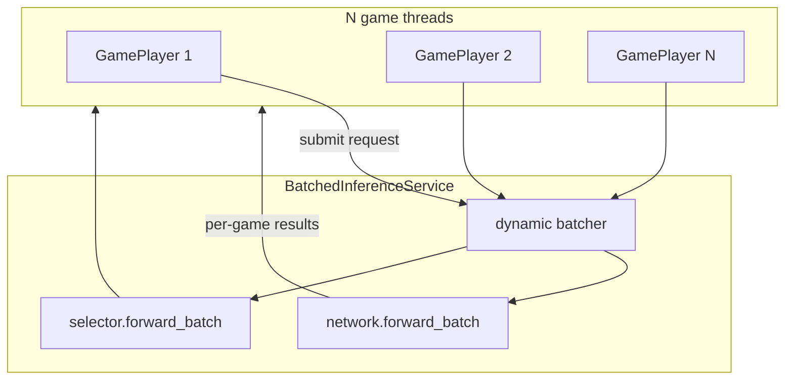

# Self-play and training

Run KumpelBrain games where both players are driven by the neural network. Games are played through the C# game engine (pythonnet); inference uses the C++ embedding pipeline plus PyTorch transformer/selector heads.

- **Self-play (inference only):** [`main.py`](main.py)
- **Training (rollout policy iteration):** [`train_self_play.py`](train_self_play.py)

```bash
# From the repository root (with venv activated and C++ extension built)
python python/main.py
```

## Prerequisites

1. **Python environment** — install dependencies from the repo root:

   ```bash
   pip install -r requirements.txt
   ```

2. **C++ embedding extension** — build the `kumpel_embedding` module (see `cpp/CMakeLists.txt`). The build output must be on the path; `main.py` adds `cpp/build` automatically.

3. **Game logic** — the C# game engine must be available to pythonnet (built as part of the KumpelTCG project). Entry points that use both PyTorch and the game engine (`main.py`, `train_self_play.py`) load CoreCLR via `csharp_runtime` **before** importing `torch`. Reversing that order can make pythonnet fall back to Mono and crash when loading .NET 10 assemblies.

## Parallel modes

Self-play parallelism is controlled by `KUMPEL_PARALLEL`. All modes share the same deck list and model architecture; they differ in how games and inference are scheduled.

| Mode | `KUMPEL_PARALLEL` | Description |
|------|-------------------|-------------|
| **Process pool** (default) | `process` | One OS process per worker; each process loads its own model copy. Best when game logic (C#) is the bottleneck and you have many CPU cores. |
| **Serial** | `serial` or `thread` | One game at a time in the main process. Useful for debugging. |
| **Coordinator** | `coordinator` | One process, many game threads, **one shared model** with dynamic batching. Best for GPU throughput or amortizing embedding/launch overhead on CPU. |

### Process pool (default)

```bash
KUMPEL_PARALLEL=process \
KUMPEL_NUM_GAMES=100 \
KUMPEL_WORKERS=8 \
KUMPEL_DEVICE=cpu \
python python/main.py
```

Each worker runs games independently with `DirectInferenceClient` (per-game `forward`, no cross-game batching).

### Coordinator (batched inference)

```bash
KUMPEL_PARALLEL=coordinator \
KUMPEL_NUM_GAMES=100 \
KUMPEL_CONCURRENT_GAMES=16 \
KUMPEL_BATCH_MAX=8 \
KUMPEL_BATCH_LINGER_MS=2 \
KUMPEL_DEVICE=cuda \
python python/main.py
```

- Many games run on **threads** in one process.
- All neural-network calls go through `BatchedInferenceService`, which groups move-evaluation and target-scoring requests into batches.
- C++ embedding runs on **`KUMPEL_DEVICE`** (same as transformer/selector) so batched GPU inference avoids CPU embedding serialization and host/device copies.
- **Known limitation:** pythonnet holds the GIL during C# callbacks, so game logic is largely serialized across threads. Throughput gains come from batched inference, not parallel game logic.
- **Batching matters:** GPU embedding pays off when `KUMPEL_BATCH_MAX` and `KUMPEL_CONCURRENT_GAMES` keep batches full. Single-game (B=1) inference on GPU is usually slower than CPU process pool.

For coordinator mode, set `KUMPEL_CONCURRENT_GAMES` ≥ `KUMPEL_BATCH_MAX` so batches stay full.

### Serial / debug

```bash
KUMPEL_PARALLEL=serial \
KUMPEL_NUM_GAMES=1 \
KUMPEL_DEVICE=cpu \
python python/main.py
```

Aliases that also select serial: `thread`, `threads`.

Process pool is skipped when `KUMPEL_WORKERS=1` or only one game is requested; execution falls back to serial.

## Environment variables

All configuration is via environment variables (no CLI flags).

### Game count

| Variable | Default | Description |
|----------|---------|-------------|
| `KUMPEL_NUM_GAMES` | *(unset)* | Total number of games to play. If set, takes precedence over batch settings. Minimum 1. |
| `KUMPEL_NUM_BATCHES` | `1` | Used when `KUMPEL_NUM_GAMES` is unset: number of batches. |
| `KUMPEL_GAMES_PER_BATCH` | `10` | Used when `KUMPEL_NUM_GAMES` is unset: games per batch. |

Effective game count:

- If `KUMPEL_NUM_GAMES` is set → `max(1, KUMPEL_NUM_GAMES)`
- Else → `max(1, KUMPEL_NUM_BATCHES × KUMPEL_GAMES_PER_BATCH)` (default **10** games)

### Parallelism

| Variable | Default | Description |
|----------|---------|-------------|
| `KUMPEL_PARALLEL` | `process` | Parallel mode (see table above). Accepted values: `process`, `processes`, `1`, `true` (process pool); `coordinator`, `coord` (batched coordinator); `serial`, `thread`, `threads` (serial). |
| `KUMPEL_WORKERS` | physical core count (capped at `num_games`) | Process-pool worker count. On Linux, defaults to **physical** cores detected via sysfs, not logical/hyperthread count. Ignored in coordinator mode. |

**Tuning `KUMPEL_WORKERS`:** the default matches physical cores (e.g. 8 on a Ryzen 7 5700X). Because workers alternate C# game logic with CPU inference, the optimum can be slightly above core count. Try a sweep when benchmarking:

```bash
for W in 8 10 12 16; do
  KUMPEL_PARALLEL=process KUMPEL_NUM_GAMES=200 KUMPEL_WORKERS=$W KUMPEL_DEVICE=cpu python python/main.py
done
```

### Coordinator batching

Only used when `KUMPEL_PARALLEL=coordinator`.

| Variable | Default | Description |
|----------|---------|-------------|
| `KUMPEL_CONCURRENT_GAMES` | `max(KUMPEL_BATCH_MAX, min(num_games, 16))` | Maximum game threads running at once. Capped at `num_games`. |
| `KUMPEL_BATCH_MAX` | `8` | Flush a batch when this many requests are queued (move-eval and target-score queues are separate). |
| `KUMPEL_BATCH_LINGER_MS` | `2` | Maximum time (ms) to wait for more requests before flushing a partial batch. Also flushes when all live games have submitted (all-blocked). |

### Inference device

| Variable | Default | Description |
|----------|---------|-------------|
| `KUMPEL_DEVICE` | `cpu` | Compute device for embedding (coordinator mode only), transformer, interaction network, and selector. Common values: `cpu`, `cuda`, `gpu` (alias for CUDA). Any string accepted by `torch.device` works (e.g. `cuda:0`). |

**Embedding device by mode:**

| Mode | Embedding device |
|------|------------------|
| `coordinator` | `KUMPEL_DEVICE` (batched on GPU when `cuda`) |
| `process` / `serial` | CPU (each worker embeds on CPU, then runs transformer on `KUMPEL_DEVICE`) |

### Profiling

| Variable | Default | Description |
|----------|---------|-------------|
| `KUMPEL_PROFILE` | *(off)* | Set to `1`, `true`, or `yes` to print per-game inference timing at game end (embedding, transformer, selector, C# export, etc.). |

### Worker process tuning (automatic)

In process-pool **child** processes, `main.py` sets `OMP_NUM_THREADS=1` and `MKL_NUM_THREADS=1` before importing torch to avoid oversubscription. Workers also call `torch.set_num_threads(1)`.

## Examples

**Quick smoke test (10 games, default process pool on CPU):**

```bash
python python/main.py
```

**100 games on default physical-core workers (no `KUMPEL_WORKERS` override):**

```bash
KUMPEL_NUM_GAMES=100 KUMPEL_DEVICE=cpu python python/main.py
```

**GPU batched self-play (coordinator; embedding + transformer on GPU):**

```bash
KUMPEL_PARALLEL=coordinator \
KUMPEL_NUM_GAMES=200 \
KUMPEL_CONCURRENT_GAMES=32 \
KUMPEL_BATCH_MAX=16 \
KUMPEL_BATCH_LINGER_MS=1 \
KUMPEL_DEVICE=cuda \
python python/main.py
```

**Single-game debug with profiling:**

```bash
KUMPEL_PARALLEL=serial \
KUMPEL_NUM_GAMES=1 \
KUMPEL_PROFILE=1 \
KUMPEL_DEVICE=cpu \
python python/main.py
```

**Explicit game count via batches:**

```bash
KUMPEL_NUM_BATCHES=5 KUMPEL_GAMES_PER_BATCH=20 python python/main.py
# Plays 100 games
```

## Benchmarking throughput

Compare coordinator (batched GPU embedding) vs process pool (parallel CPU embedding):

```bash
# Coordinator + GPU embedding (keep batches full)
KUMPEL_PARALLEL=coordinator \
KUMPEL_NUM_GAMES=1000 \
KUMPEL_CONCURRENT_GAMES=64 \
KUMPEL_BATCH_MAX=16 \
KUMPEL_BATCH_LINGER_MS=2 \
KUMPEL_DEVICE=cuda \
python python/main.py

# Process pool on CPU (default physical-core workers)
KUMPEL_PARALLEL=process \
KUMPEL_NUM_GAMES=1000 \
KUMPEL_DEVICE=cpu \
python python/main.py
```

Use `KUMPEL_PROFILE=1` on a single serial game to see whether embedding or transformer dominates before choosing a mode.

## Training

Training uses rollout-based approximate policy iteration. It samples forced root
actions from the champion policy, estimates soft win probabilities from repeated
continuations, trains separate value and policy heads, and only promotes
candidates that beat the current champion.

Entry point: [`train_self_play.py`](train_self_play.py)

The complete algorithm and mathematics are documented in
[`training-algorithm.md`](../training-algorithm.md).

### Quick start

```bash
KUMPEL_DEVICE=cuda .venv/bin/python python/train_self_play.py
```

One invocation performs a complete iteration:

1. collect 100 stochastic seed games;
2. sample 256 phase-balanced root states;
3. run 10 sampled forced root-action rollouts per root, plus capped target evaluation;
4. train for 1,000 optimizer steps from five recent rollout shards;
5. gate the candidate against the champion for 200–800 games.

Rollouts are stored in `training_data/rollouts`. The champion, rejected
candidate, history, and manifest are stored in `training_data/models`.
Existing trajectory shards and old checkpoints are intentionally unsupported.

Useful overrides:

```bash
KUMPEL_DEVICE=cuda .venv/bin/python python/train_self_play.py \
  --seed-games 200 \
  --root-states 512 \
  --train-steps 1500 \
  --batch-size 128 \
  --concurrent-games 32 \
  --inference-batch-size 16 \
  --root-action-rollouts 10 \
  --root-action-temperature 1.0 \
  --target-contexts-per-action 2 \
  --target-choices-per-context 3 \
  --target-rollouts-per-choice 1
```

### Automated training cycles

Run complete iterations until the iteration or runtime limit is reached:

```bash
KUMPEL_DEVICE=cuda .venv/bin/python python/automate_training.py \
  --max-runtime-hours 8
```

The runtime budget is checked only before starting another complete iteration.
An active iteration is never interrupted by the automation wrapper.

### Training tests

```bash
python -m pytest python/pytests python/network/pytests

KUMPEL_ENABLE_CSHARP_TESTS=1 python -m pytest python/pytests/test_recreate_wrapper.py
```

## Output

At the end of a run, `main.py` prints:

- Total elapsed time
- Games per second

With `KUMPEL_PROFILE=1`, each game additionally prints a breakdown when it finishes.

## Architecture (coordinator mode)



Game threads only build small CPU index tensors and block on results. Inference worker threads own the shared `KumpelNetwork` and `Selector`.

## Tests

```bash
# Network / embedding tests
python -m pytest python/network/pytests/

# Coordinator smoke tests
python -m pytest python/pytests/

# Rollout training tests
python -m pytest \
  python/pytests/test_rollout_data.py \
  python/pytests/test_rollout_trainer.py \
  python/pytests/test_policy_iteration.py \
  python/pytests/test_forced_rollout.py
```
