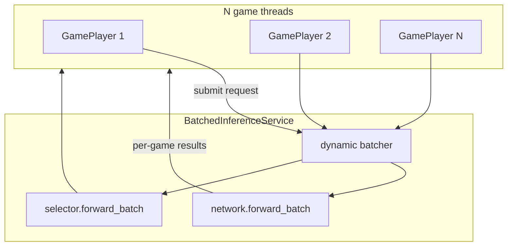

# Self-play

Run KumpelBrain games where both players are driven by the neural network. Games are played through the C# game engine (pythonnet); inference uses the C++ embedding pipeline plus PyTorch transformer/selector heads.

Entry point: [`main.py`](main.py)

```bash
# From the repository root (with venv activated and C++ extension built)
python python/main.py
```

## Prerequisites

1. **Python environment** — install dependencies from the repo root:

   ```bash
   pip install -r requirements.txt
   ```

2. **C++ embedding extension** — build the `kumpel_embedding` module (see `cpp/CMakeLists.txt`). The build output must be on the path; `main.py` adds `cpp/build` automatically.

3. **Game logic** — the C# game engine must be available to pythonnet (built as part of the KumpelTCG project).

## Parallel modes

Self-play parallelism is controlled by `KUMPEL_PARALLEL`. All modes share the same deck list and model architecture; they differ in how games and inference are scheduled.

| Mode | `KUMPEL_PARALLEL` | Description |
|------|-------------------|-------------|
| **Process pool** (default) | `process` | One OS process per worker; each process loads its own model copy. Best when game logic (C#) is the bottleneck and you have many CPU cores. |
| **Serial** | `serial` or `thread` | One game at a time in the main process. Useful for debugging. |
| **Coordinator** | `coordinator` | One process, many game threads, **one shared model** with dynamic batching. Best for GPU throughput or amortizing embedding/launch overhead on CPU. |

### Process pool (default)

```bash
KUMPEL_PARALLEL=process \
KUMPEL_NUM_GAMES=100 \
KUMPEL_WORKERS=8 \
KUMPEL_DEVICE=cpu \
python python/main.py
```

Each worker runs games independently with `DirectInferenceClient` (per-game `forward`, no cross-game batching).

### Coordinator (batched inference)

```bash
KUMPEL_PARALLEL=coordinator \
KUMPEL_NUM_GAMES=100 \
KUMPEL_CONCURRENT_GAMES=16 \
KUMPEL_BATCH_MAX=8 \
KUMPEL_BATCH_LINGER_MS=2 \
KUMPEL_DEVICE=cuda \
python python/main.py
```

- Many games run on **threads** in one process.
- All neural-network calls go through `BatchedInferenceService`, which groups move-evaluation and target-scoring requests into batches.
- C++ embedding runs on **CPU**; transformer, interaction network, and selector run on `KUMPEL_DEVICE`.
- **Known limitation:** pythonnet holds the GIL during C# callbacks, so game logic is largely serialized across threads. Throughput gains come from batched inference, not parallel game logic.

For coordinator mode, set `KUMPEL_CONCURRENT_GAMES` ≥ `KUMPEL_BATCH_MAX` so batches stay full.

### Serial / debug

```bash
KUMPEL_PARALLEL=serial \
KUMPEL_NUM_GAMES=1 \
KUMPEL_DEVICE=cpu \
python python/main.py
```

Aliases that also select serial: `thread`, `threads`.

Process pool is skipped when `KUMPEL_WORKERS=1` or only one game is requested; execution falls back to serial.

## Environment variables

All configuration is via environment variables (no CLI flags).

### Game count

| Variable | Default | Description |
|----------|---------|-------------|
| `KUMPEL_NUM_GAMES` | *(unset)* | Total number of games to play. If set, takes precedence over batch settings. Minimum 1. |
| `KUMPEL_NUM_BATCHES` | `1` | Used when `KUMPEL_NUM_GAMES` is unset: number of batches. |
| `KUMPEL_GAMES_PER_BATCH` | `10` | Used when `KUMPEL_NUM_GAMES` is unset: games per batch. |

Effective game count:

- If `KUMPEL_NUM_GAMES` is set → `max(1, KUMPEL_NUM_GAMES)`
- Else → `max(1, KUMPEL_NUM_BATCHES × KUMPEL_GAMES_PER_BATCH)` (default **10** games)

### Parallelism

| Variable | Default | Description |
|----------|---------|-------------|
| `KUMPEL_PARALLEL` | `process` | Parallel mode (see table above). Accepted values: `process`, `processes`, `1`, `true` (process pool); `coordinator`, `coord` (batched coordinator); `serial`, `thread`, `threads` (serial). |
| `KUMPEL_WORKERS` | `min(cpu_count, num_games)` | Process-pool worker count. Capped at `num_games`. Ignored in coordinator mode. |

### Coordinator batching

Only used when `KUMPEL_PARALLEL=coordinator`.

| Variable | Default | Description |
|----------|---------|-------------|
| `KUMPEL_CONCURRENT_GAMES` | `max(KUMPEL_BATCH_MAX, min(num_games, 16))` | Maximum game threads running at once. Capped at `num_games`. |
| `KUMPEL_BATCH_MAX` | `8` | Flush a batch when this many requests are queued (move-eval and target-score queues are separate). |
| `KUMPEL_BATCH_LINGER_MS` | `2` | Maximum time (ms) to wait for more requests before flushing a partial batch. Also flushes when all live games have submitted (all-blocked). |

### Inference device

| Variable | Default | Description |
|----------|---------|-------------|
| `KUMPEL_DEVICE` | `cpu` | Compute device for transformer, interaction network, and selector. Common values: `cpu`, `cuda`, `gpu` (alias for CUDA). Any string accepted by `torch.device` works (e.g. `cuda:0`). |

Embedding (`embedGameState` / `embedGameInteraction`) always runs on CPU in the current implementation.

### Profiling

| Variable | Default | Description |
|----------|---------|-------------|
| `KUMPEL_PROFILE` | *(off)* | Set to `1`, `true`, or `yes` to print per-game inference timing at game end (embedding, transformer, selector, C# export, etc.). |

### Worker process tuning (automatic)

In process-pool **child** processes, `main.py` sets `OMP_NUM_THREADS=1` and `MKL_NUM_THREADS=1` before importing torch to avoid oversubscription. Workers also call `torch.set_num_threads(1)`.

## Examples

**Quick smoke test (10 games, default process pool on CPU):**

```bash
python python/main.py
```

**100 games on 8 CPU workers:**

```bash
KUMPEL_NUM_GAMES=100 KUMPEL_WORKERS=8 KUMPEL_DEVICE=cpu python python/main.py
```

**GPU batched self-play (recommended for throughput):**

```bash
KUMPEL_PARALLEL=coordinator \
KUMPEL_NUM_GAMES=200 \
KUMPEL_CONCURRENT_GAMES=32 \
KUMPEL_BATCH_MAX=16 \
KUMPEL_BATCH_LINGER_MS=1 \
KUMPEL_DEVICE=cuda \
python python/main.py
```

**Single-game debug with profiling:**

```bash
KUMPEL_PARALLEL=serial \
KUMPEL_NUM_GAMES=1 \
KUMPEL_PROFILE=1 \
KUMPEL_DEVICE=cpu \
python python/main.py
```

**Explicit game count via batches:**

```bash
KUMPEL_NUM_BATCHES=5 KUMPEL_GAMES_PER_BATCH=20 python python/main.py
# Plays 100 games
```

## Output

At the end of a run, `main.py` prints:

- Total elapsed time
- Games per second

With `KUMPEL_PROFILE=1`, each game additionally prints a breakdown when it finishes.

## Architecture (coordinator mode)



Game threads only build small CPU index tensors and block on results. Inference worker threads own the shared `KumpelNetwork` and `Selector`.

## Tests

```bash
# Network / embedding tests
python -m pytest python/network/pytests/

# Coordinator smoke tests
python -m pytest python/pytests/
```
